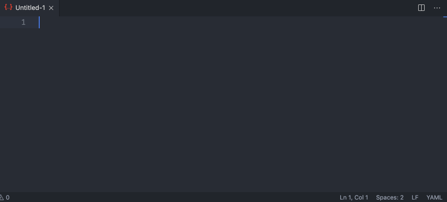
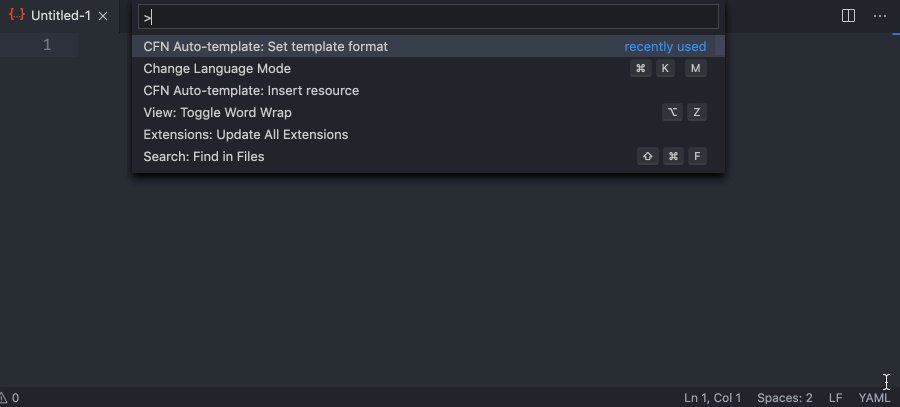
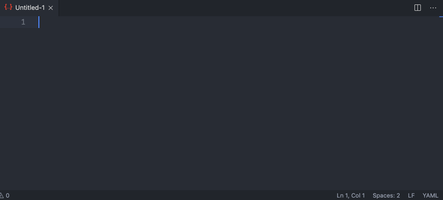
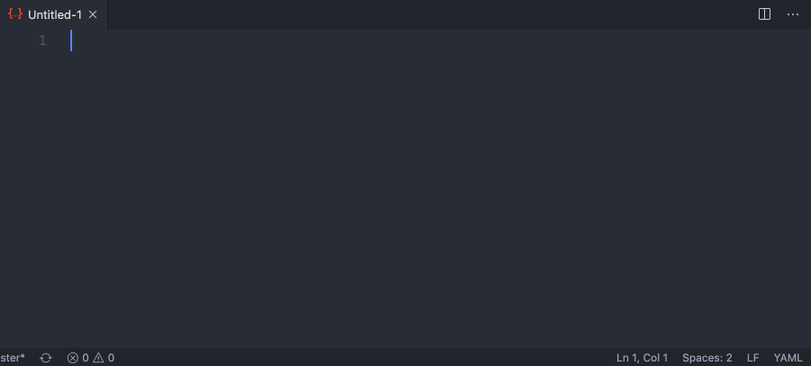
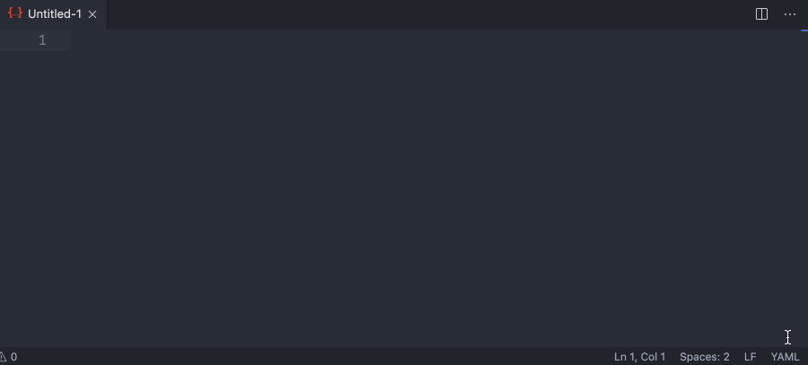
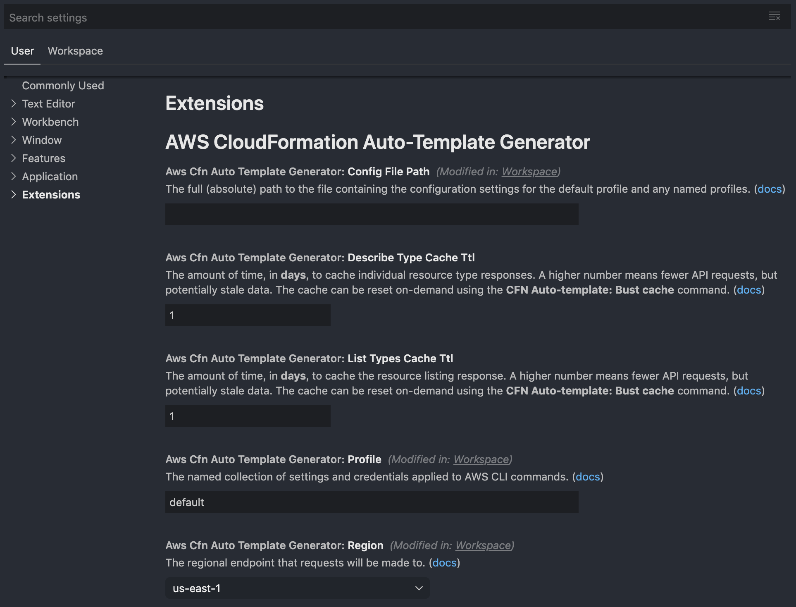

# vscode-aws-cloudformation-auto-template-generator
VS Code extension for automatically generating fully-expanded AWS CloudFormation resource templates.

[](https://travis-ci.org/john-goldsmith/vscode-aws-cloudformation-auto-template-generator)
[](https://codeclimate.com/github/john-goldsmith/vscode-aws-cloudformation-auto-template-generator/test_coverage)
[](https://codeclimate.com/github/john-goldsmith/vscode-aws-cloudformation-auto-template-generator/maintainability)
[](https://coveralls.io/github/john-goldsmith/vscode-aws-cloudformation-auto-template-generator?branch=master)
[](https://david-dm.org)
[](https://snyk.io/test/github/john-goldsmith/vscode-aws-cloudformation-auto-template-generator?targetFile=package.json)
[](https://greenkeeper.io/) [](https://gitter.im/vscode-aws-cloudformation-auto-template-generator/community?utm_source=badge&utm_medium=badge&utm_campaign=pr-badge&utm_content=badge)

## Features

### Insert CloudFormation resource
Displays a prompt where an AWS resource type can be selected, and then inserts the fully-expanded template into the current text editor.

<kbd>Command Palette</kbd> > <kbd>CFN Auto-template: Insert resource</kbd>


### Set AWS profile
Displays a prompt where a preferred AWS profile can be selected. The list of profiles are determined by the provided configuration file path. The AWS region will be automatically set if the selected profile definition includes a `region` value.

<kbd>Command Palette</kbd> > <kbd>CFN Auto-template: Set profile</kbd>



### Set Template Format
Displays a prompt where a preferred template format can be selected. The only options supported are `JSON` and `YAML`. Note that this setting will be ignored if the format of the currently active text editor is set to JSON or YAML, in which case the produced template will be automatically detected.

<kbd>Command Palette</kbd> > <kbd>CFN Auto-template: Set template format</kbd>



### Set Config File Path
Displays a prompt where an absolute path to an AWS configuration file can be provided. This will check that the file exists, parse the file contents, and validate that the file has at least one profile. If all checks pass, it will display a prompt where a preferred AWS profile can be selected.

<kbd>Command Palette</kbd> > <kbd>CFN Auto-template: Set config file path</kbd>



### Set Resource Visibility
Displays a prompt where a preferred resource visibility can be selected. The only options supported by AWS are `PUBLIC` (AWS-provided resources) and `PRIVATE` (user-provided custom resources).

<kbd>Command Palette</kbd> > <kbd>CFN Auto-template: Set resource visibility</kbd>



### Set AWS Region
Displays a prompt where a preferred AWS region can be selected, influencing which endpoint API calls are made against. Note that this will override the `region` value found in the configuration file.

<kbd>Command Palette</kbd> > <kbd>CFN Auto-template: Set region</kbd>


### Bust Cache
By default, fetching a list of resources (public and private) and individual resources (public and private) are cached, per workspace, for 1 day. This convenience method will clear that cache. This can be especially useful for private CloudFormation types that are being registered and deregistered at-will.

<kbd>Command Palette</kbd> > <kbd>CFN Auto-template: Bust cache</kbd>



## Settings
All settings can be modified by going to <kbd>Preferences</kbd> > <kbd>Settings</kbd> > <kbd>Extensions</kbd> > <kbd>AWS CloudFormation Auto-template Generator</kbd>



## Impetus
When working with AWS CloudFormation templates, I often find myself referencing the official documentation for a particular resource, which references a nested type, which references a nested type, which references...so on and so forth until reaching the string or boolean value that I'm looking for. This extension helps reduce that friction by automatically expanding the **full** template for any AWS resource, supporting both JSON and YAML templates.

For example, the commonplace [`AWS::S3::Bucket`](https://docs.aws.amazon.com/AWSCloudFormation/latest/UserGuide/aws-properties-s3-bucket.html) resource has a property that's nested 5 levels deep until a final string value is reached, with each attribute along the way having it's own structure and sub-attributes:

```yaml
ReplicationConfiguration
  Rules # This happens to be an array...
    SourceSelectionCriteria
      SseKmsEncryptedObjects
        Status # Finally reached the string value!
```

I've personally found the approach of working with a fully expanded template beneficial for learning CloudFormation, because it helps present a complete picture of the resource.  Often times I know I need an S3 bucket, but it's unclear what options are available or how other resources might reference each other.

## Running Locally & Debugging

1. Clone this repo (`git clone https://github.com/john-goldsmith/vscode-aws-cloudformation-auto-template-generator.git`)
1. Ensure that [Node](https://nodejs.org) and NPM are installed
1. Run `npm install` to install dependencies
1. In the "Run" panel of VS Code (<kbd>View</kbd> > <kbd>Run</kbd>), choose the ["Run Extension"](./.vscode/launch.json) configuration, and click "Start Debugging" (shortcut: <kbd>F5</kbd>)
1. In VS Code, set breakpoints as desired.

See [vsc-extension-quickstart.md](./vsc-extension-quickstart.md) for additional details.

## Tests
See [test/unit](./test/unit) for test suite, and [Travis CI](https://travis-ci.org/john-goldsmith/vscode-aws-cloudformation-auto-template-generator) and [Code Climate](https://codeclimate.com/github/john-goldsmith/vscode-aws-cloudformation-auto-template-generator) for coverage.

1. Run `npm run test:unit`

Current coverage:

```
Test Suites: 32 passed, 32 total
Tests:       133 passed, 133 total
```

## Linting

See [.eslintrc.json](./.eslintrc.json) for configuration options.

1. Run `npm run lint`

## To Do

* i18n / l10n
* DRY up unit tests
* Account for [`VersionId`](https://docs.aws.amazon.com/AWSJavaScriptSDK/latest/AWS/CloudFormation.html#describeType-property) when describing a resource
* Implement [STS](https://docs.aws.amazon.com/AWSJavaScriptSDK/latest/AWS/STS.html)
* Convert to TypeScript
